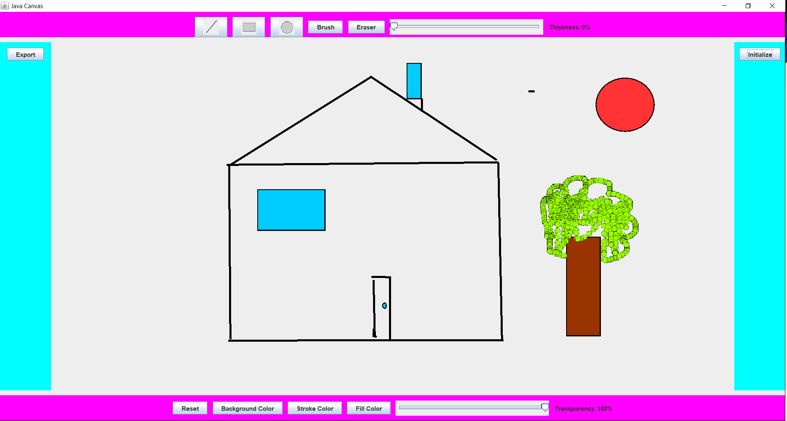
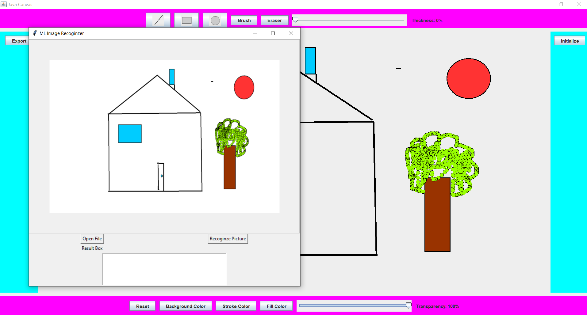

# JavaCanvas: An Online Java Drawing Board
## **Removing the previous old messy branches to clean up the code base and file structure. The new version cleaned up and refactored the code while also added new features. **

This is a drawing board written in Java. 
The user is capable of:
1. Selecting filling and stroke color from a palate and adjusting the thickness and transparency of the stroke and lines using a slide bar. 
2. The user can draw straight lines, curves, rectangle and ellipses with the thickness, color and transparency that are set before.
3. The user can use reset the drawing board and start over.
4. The user can change the background color of the drawing board and while painitings on the canvas would be preserved during background color change.
5. The user can use eraser to wipe out unwanted shapes and drawings. The color of the eraser will be consistent with the background color.
6. After drawing, the user can click export button to convert the drawing into a png file and save it to a location with the help of a file chooser pop up.
7. There is also a Initialize button, which will launch script **frontEndGui.py** 
This is a GUI script written with Tkinter which can let the user select and display the drawing previously exported form JavaCanvas.
**The purpose of this script is for the potential enhancement: Idealy the python script will also carry a function that implements a machine learning algorithm that will try guessing what the painting represents. This will transform this project from a simple drawing board to a image recoginition application.  (This enchancement is still currently in the phase of scoping, updates will come in the future)**
 **Any updates and enchancements will be based upon the new clean refactored verison. **

Here is a video of the presentation of this game (without image recogition algorithm) [Screen Demo of JavaCanvas](https://youtu.be/V9NpbfxRACI)  

Here is a screen shot of the program:

