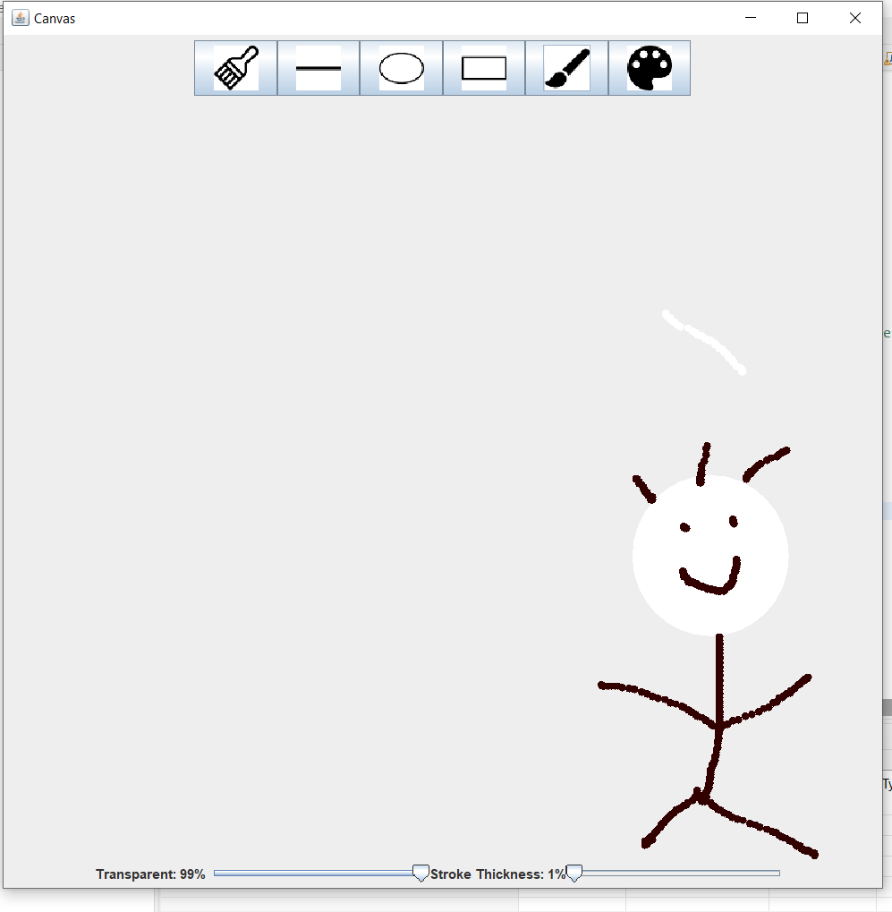

# Online Java Drawing Board
This is a drawing board written in Java. The user is capable of selecting filling and stroke color from a palate and adjusting the thickness and transparency of the stroke and lines using a slide bar. The user can draw straight lines, curves, rectangle and ellipses with the thickness, color and transparency he/she set before. \
Here is a video of the presentation of this game:
[Screen recording of demonstrating JavaCanvas](https://youtu.be/na7axQ47WGE)\
Here is a screen shot of the program:\

